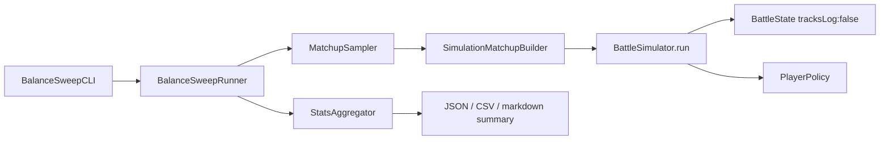

# Battle Balance Simulator

Plan for a headless, non-user-facing battle simulator that runs bulk matchups through `BattleEngine` and surfaces win-rate / power anomalies across Heroes, Pets, Enemies, Abilities, and Item Affixes at Early / Mid / Late scopes.

**Status:** Draft (design) — awaiting product decisions on open questions below  
**Related:** Surviving scaffolding in `SimulationTierProfile.swift` / `SimulationResults.swift`; prior tooling removed in `BattleCardCombatMigration.md` Phase 1

---

## Goals

1. **Run battles in code only** — no UI, no `BattleSession`, no SFX/spectacle. Drive `BattleState` with `tracksLog: false`.
2. **Bulk throughput** — hundreds to thousands of battles in seconds on a developer Mac (CLI / package executable).
3. **Collect stats** at three power scopes (already sketched as `SimulationPowerTier`):
   - **Early** — level 1, no items
   - **Middle** — level 20, Basic rarity gear (1 affix)
   - **Late** — level 40, Astral rarity gear (3 affixes)
4. **Detect balance anomalies** — entities that are systematically over- or under-powered relative to tier targets and peers.
5. **Reproducible** — every battle keyed by seed; any outlier fight can be re-run bit-identically.

## Non-goals (v1)

- Player-facing UI, in-app debug screens, or CloudKit.
- Perfect “optimal play” AI (see Player Policy).
- Replacing content authoring / TSV workflows.
- Hard CI balance gates on day one (optional later once baselines stabilize).
- Journey-stage fidelity beyond tier level + enemy identity (aspects/labyrinth can come later).

---

## Current state (what we inherit)

| Asset | Status |
|---|---|
| `BattleState` + `playCard` / `endTurn` | Ready — headless entry point |
| Enemy cadence AI | Ready — deterministic Basic / Skill@3 / Ult@6 |
| `SimulationPowerTier` / `ConfiguredSimulationMatchup` | Scaffolding only — no builder or runner |
| `CombatBuildResolver` / `CombatantLevelScaler` / `ThemedGearGenerator` | Ready for matchup assembly |
| `BattleSimulator` / `BattleBalanceTools` / `BalanceSweepCLI` | **Deleted** in card-combat migration — rebuild, do not resurrect tick-era code |
| Player autoplay | Test-only naive “first playable card” — **not** suitable for balance claims |
| Win-rate targets in `StatGrowth.enemyGearCompensation` | Documented: fodder ~90–99% / 80–90% / 70–80%; bosses-elites ~70–80% across tiers |

Catalog scale (approx.): **7 heroes × 12 pets × 15 enemies**, ~86 abilities, ~89 affixes, 27 item bases.

---

## Statistical design

### Why not full factorial?

A naive grid explodes:

- Base identities: \(7 \times 12 \times 15 = 1{,}260\) matchups per tier.
- Ability loadouts: typically \(2^3 = 8\) choices per combatant → \(8 \times 8 = 64\) party loadouts → ~80k identity×loadout cells **before** gear and seeds.
- Mid/late gear: themed loadouts × affix rolls multiply further.

**Recommendation:** stratified Monte Carlo sampling with hierarchical aggregation — not exhaustive enumeration.

### Sampling model (recommended)

Treat each simulated battle as a draw from a generative process:

```
tier ~ {early, middle, lateGame}
hero, pet, enemy ~ catalog (stratified)
heroLoadout, petLoadout ~ ability choice pools (or fixed “canonical” for early)
gear ~ ThemedGearGenerator / ItemGenerator when tier.includesGear
seed ~ UInt64 (battle RNG + any gear RNG derived from it)
playerPolicy ~ fixed policy for the sweep
→ outcome ∈ {victory, defeat}, plus secondary metrics
```

**Stratification axes (always cover evenly):**

1. Power tier (Early / Mid / Late)
2. Enemy class (fodder / elite / boss) — separate target bands
3. Hero identity (equal weight per hero)
4. Pet identity (equal weight per pet)

**Within strata:** sample loadouts and gear randomly (seeded), with optional focused sweeps (see below).

### Sample size guidance

Win rate is a binomial proportion. Approximate 95% CI half-width:

| Battles per cell (\(n\)) | Rough CI (±) |
|---|---|
| 100 | ~10 pp |
| 400 | ~5 pp |
| 1,600 | ~2.5 pp |

**Recommendations:**

| Sweep mode | Intent | Budget |
|---|---|---|
| **Smoke** | Sanity / CI canary | ~300–1k battles total |
| **Standard** | Day-to-day balance | ~3–5k battles / tier (~10–15k total) |
| **Deep** | Pre-balance pass | ~10k+ / tier; plus focused entity sweeps |

For **marginal** entity rates (e.g. “Knight win rate across all pets/enemies”), \(n\) pools across partners — 400+ battles **per hero per tier** is a practical minimum for ±5 pp claims. Prefer reporting **Wilson score intervals** (or Jeffreys) rather than raw percentages.

### Aggregation & anomaly detection

Raw per-matchup tables are noisy. Prefer:

1. **Marginal win rates** with Wilson CIs for each Hero / Pet / Enemy / Ability / Affix, per tier (and enemy class).
2. **Shrinkage / empirical Bayes** toward the tier×enemy-class prior so small-\(n\) entities don’t false-alarm.
3. **Relative lift** vs peer mean:  
   \(\Delta = \hat{p}_{\text{entity}} - \hat{p}_{\text{peer}}\)  
   Flag when CI for \(\Delta\) excludes 0 by a configurable margin (e.g. 8–10 pp for heroes/pets; tighter for enemies vs target band).
4. **Target-band checks** against `enemyGearCompensation` intent (fodder/boss bands above).
5. **Secondary metrics** to separate “wins too easily” from “wins at all”:
   - rounds to outcome (`tickCount`)
   - party HP remaining % on victory
   - enemy HP remaining % on defeat
   - stall / timeout rate (hit action/round cap)

**Ability / affix attribution (important):**

- Do **not** only report “battles where ability X was in the loadout.” That confounds with hero identity.
- Prefer **paired contrasts**: same hero/pet/enemy/gear/seed family, swap one ability (or one affix) vs baseline → estimate causal lift.
- For affixes: hold base item + other affixes fixed when possible; or use regression with hero/pet/enemy fixed effects if sample is large.

### Reproducibility

- Every battle stores `(tier, heroID, petID, enemyID, loadoutIDs, gearSeed, battleSeed, policyID, outcome, metrics)`.
- CLI can re-run a single row by ID/seed for debugging.
- Sweep config (policy version, catalog hash, engine version) recorded in report header.

---

## Architecture



### Package placement

| Layer | Location | Responsibility |
|---|---|---|
| Core runner | `Packages/BattleEngine` | `BattleSimulator`, `PlayerPolicy`, result types, matchup builder |
| Sweep / stats | `Packages/BattleEngine` (e.g. `BalanceSweep/` sources) **or** thin sibling target | Sampling, aggregation, anomaly flags |
| CLI | `BalanceSweepCLI` executable product on `BattleEngine` package | Args → run → print/write report |
| Scripts | `Scripts/balance-sweep.sh` | Convenience wrapper; optional later CI gate |
| App | **None** | Keep out of `BattleSession` / Features |

**Recommendation:** Put the simulator and policies in `BattleEngine` (rules-adjacent, testable). Put heavy report formatting in the CLI target so the library stays lean. Do not put this in the Trinket app target.

### Core APIs (sketch)

```swift
public protocol PlayerPolicy: Sendable {
    /// Choose next action given a read-only battle snapshot.
    func nextAction(in battle: BattleState) -> SimAction
}

public enum SimAction: Sendable {
    case playCard(id: Int)
    case endTurn
}

public struct BattleSimResult: Sendable {
    public var outcome: BattleSimulationOutcome
    public var rounds: Int
    public var actions: Int
    public var timedOut: Bool
    public var partyHPRemainingFraction: Double
    public var enemyHPRemainingFraction: Double
    // optional: damage dealt/taken totals if cheap to track
}

public enum BattleSimulator {
    public static func run(
        matchup: ConfiguredSimulationMatchup,
        policy: some PlayerPolicy,
        maxRounds: Int = 100,
        maxActions: Int = 500
    ) -> BattleSimResult
}
```

### Matchup builder

Wire the dormant types:

1. Scale hero/pet/enemy to `tier.level` via `CombatantLevelScaler`.
2. Apply `AbilityLoadout` selections onto combatants.
3. If `tier.includesGear`, generate themed equipment via `ThemedGearGenerator` / `ItemGenerator` using a derived seed; resolve with `CombatBuildResolver`.
4. Emit `ConfiguredSimulationMatchup`.

### Engine performance knobs

Required for bulk speed:

1. `BattleState(..., tracksLog: false)` + `rebuildLog: false` on every step.
2. **Add** `tracksEvents: Bool = true` (default on for app/tests; **false** in sim) — today `events` always append and will dominate allocation in long fights.
3. Never touch `BattleSession`, log projection, or effect summary builders in the hot path.
4. Parallelize across battles with `TaskGroup` / concurrent map (each battle owns its own `BattleState`; pure value mutation). Cap concurrency to CPU count.
5. Round/action caps to kill stalls; count timeouts separately from defeats.

**Throughput target:** aim for ≥100–500 battles/sec on a modern Mac for early-tier fights once events are disabled; validate with a micro-benchmark in package tests or CLI `--bench`.

---

## Player policy (largest validity risk)

Enemy AI is fixed. **Player policy choice dominates measured win rates.**

| Policy | Pros | Cons | When to use |
|---|---|---|---|
| **A. Naive first-playable** (current test helper) | Trivial | Biased by hand order; undervalues setup/control | Smoke only |
| **B. Greedy heuristic** (recommended v1) | Fast, deterministic-ish, plays most cards | Not optimal; may undervalue complex combos | Standard sweeps |
| **C. Random legal** | Unbiased among legal moves; good for variance | High noise; weak play → compressed win rates | Sensitivity check |
| **D. Scripted / ability-priority tables** | Tunable per hero | Content maintenance burden | Later, if B is insufficient |

**Recommended v1 greedy heuristic:**

1. While playable cards remain:
   - Prefer lethal if detectable cheaply (enemy HP ≤ estimated damage of a card).
   - Else prefer Ultimate → Skill → Basic (by tier), breaking ties by expected damage / heal / defensive value heuristics from effect kinds.
   - Prefer cards whose owner is not control-skipped / dead (already unplayable).
2. End turn when no playable cards remain (mirrors production auto-end).

Ship policy as a versioned ID in reports (`greedy-v1`). Re-run sensitivity with `random-legal` on a subset to see if rankings flip.

---

## Sweep modes

### 1. Identity sweep (default)

Stratified sample over hero × pet × enemy × tier. Random loadouts (mid/late) and gear. Answers: “Is Knight overtuned at Late?”

### 2. Ability contrast sweep

For a focus ability (or all abilities in catalog): paired battles with ability in vs out (or vs sibling choice), holding other factors fixed. Answers: “Is Smite overtuned relative to Plate Mail?”

### 3. Affix contrast sweep

Mid/Late only. Paired or stratified samples isolating one affix. Answers: “Is this Astral affix a power outlier?”

### 4. Enemy band check

Per enemy × tier, aggregate win rate vs documented target bands; flag misses.

---

## Report shape

**Machine-readable:** JSON (full) + CSV (flat margins) for spreadsheets.

**Human summary (stdout / markdown):**

```
Balance Sweep  engine=…  policy=greedy-v1  n=12000  tiers=early,middle,lateGame

## Late · Hero margins (Wilson 95%)
Knight   78% [74–82]  Δ+12 vs peer  ⚠ HIGH
Wizard   51% [46–56]  Δ−15 vs peer  ⚠ LOW
…

## Late · Enemy bands
skeleton (fodder)  74%  target 70–80  OK
dragon   (boss)    91%  target 70–80  ⚠ EASY
…

## Top ability lifts (paired)
smite     +14 pp  n=400
…
```

Anomaly thresholds should be configurable flags, not hardcoded forever.

---

## Implementation phases

### Phase 0 — Plan lock

- [ ] Resolve open questions (below)
- [ ] Land this doc; link from `Docs/Platform` / AgentContext if useful

### Phase 1 — Headless runner (foundation)

- [ ] `BattleSimulator.run` over `ConfiguredSimulationMatchup`
- [ ] `PlayerPolicy` + `GreedyHeuristicPolicy` (+ `NaiveFirstPlayable` for parity with tests)
- [ ] `BattleSimResult` metrics
- [ ] Optional `tracksEvents: false` on `BattleState`
- [ ] Package tests: seeded determinism, timeout behavior, outcome parity smoke
- [ ] Micro-benchmark / CLI `--bench` for throughput

### Phase 2 — Matchup builder + tiers

- [ ] `SimulationMatchupBuilder` using `SimulationPowerTier`
- [ ] Level scale + loadout apply + gear generation
- [ ] Unit tests for early (no gear) and mid/late (gear present)

### Phase 3 — Sweep + aggregation

- [ ] `MatchupSampler` (stratified)
- [ ] `StatsAggregator` (margins, Wilson CIs, Δ vs peer, target bands)
- [ ] Ability / affix contrast helpers
- [ ] JSON/CSV emitters

### Phase 4 — CLI + script

- [ ] Restore `BalanceSweepCLI` executable product
- [ ] `Scripts/balance-sweep.sh` wrapper
- [ ] Document invocation in `Scripts/README.md` / BattleEngine README

### Phase 5 — Hardening (optional)

- [ ] Parallel sweep
- [ ] Empirical Bayes shrinkage
- [ ] Optional CI smoke (not a hard gate until baselines trusted)
- [ ] Journey-stage / aspect encounter modes

---

## Verification

Per AGENTS.md / battle context:

- Any Swift change: `./Scripts/test.sh style` + `./Scripts/test-package.sh BattleEngine`
- Simulator unit tests live in `BattleEngineTests` (not UI/smoke)
- Without Xcode 26: still run generation/style/package checks that apply; note skipped simulator work
- Manual: `swift run BalanceSweepCLI --mode smoke` (or script) and inspect report

---

## Risks

| Risk | Mitigation |
|---|---|
| Policy bias masquerades as balance | Version policies; sensitivity with random-legal; document “under policy X” |
| Confounded ability/affix stats | Paired contrasts, not only marginals |
| Event log allocation kills speed | `tracksEvents: false` |
| Stall battles | Round/action caps; report timeout rate |
| Tier targets stale post-migration | Re-validate bands empirically; adjust `enemyGearCompensation` separately from sim |
| Parallel RNG / data races | One `BattleState` per task; value types; no shared mutable catalog |

---

## Open questions (need decisions)

See the companion note in the PR / discussion — recommendations included with each question.
