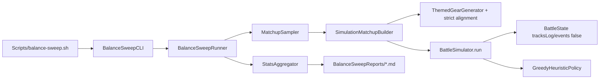

# Battle Balance Simulator

Headless, non-user-facing battle simulator that runs bulk matchups through `BattleEngine` and surfaces win-rate / power anomalies across Heroes, Pets, Enemies, Abilities, and Item Affixes at Early / Mid / Late scopes.

**Status:** Implemented — identity sweeps, parallel jobs, paired ability/affix contrasts; CLI ready where Swift/Xcode is available  
**Related:** Scaffolding in `SimulationTierProfile.swift` / `SimulationResults.swift`; prior tooling removed in `BattleCardCombatMigration.md` Phase 1

---

## Locked decisions

| Topic | Decision |
|---|---|
| Player policy | **Greedy heuristic** (`greedy-v1`): prefer lethal, then Ult → Skill → Basic by rough value, then end turn |
| Sample size | Default **1,000 battles per tier**; `--battles-per-tier` (or equivalent) is a free parameter — no smoke/standard/deep presets |
| Gear theming | Affixes must **align with selected ability keywords**; **generic** affixes (no damage-type keywords) allowed on anyone; no mismatched builds (e.g. Poison on Knight) |
| CI / gates | **None** — manual CLI only, no automations |
| Power tiers | Keep `SimulationPowerTier` as-is (Early L1 no gear / Mid L20 Basic 1-affix / Late L40 Astral 3-affix) |
| Encounter scope | Catalog identities + scaled level (not journey stage graph); aspects/labyrinth later |
| Report output | **Markdown** files under an **uncommitted** folder (`BalanceSweepReports/`) |
| Invocation | Simplest agent path: `./Scripts/balance-sweep.sh` → `swift run` SPM executable |

---

## Goals

1. **Run battles in code only** — no UI, no `BattleSession`, no SFX/spectacle. Drive `BattleState` with `tracksLog: false` and `tracksEvents: false`.
2. **Bulk throughput** — hundreds to thousands of battles quickly on a developer Mac.
3. **Collect stats** at Early / Mid / Late (`SimulationPowerTier`).
4. **Detect balance anomalies** — entities systematically over- or under-powered vs peers and target bands.
5. **Reproducible** — every battle keyed by seed; re-run outliers bit-identically.

## Non-goals (v1)

- Player-facing UI or in-app debug screens.
- Perfect optimal-play AI.
- CI balance gates, smoke presets, or scheduled automations.
- Journey-stage / aspect / labyrinth encounter fidelity.

---

## Current state (what we inherit)

| Asset | Status |
|---|---|
| `BattleState` + `playCard` / `endTurn` | Ready — headless entry point |
| Enemy cadence AI | Ready — Basic / Skill@3 / Ult@6 |
| `SimulationPowerTier` / `ConfiguredSimulationMatchup` | Scaffolding — builder + runner being added |
| `CombatBuildResolver` / `CombatantLevelScaler` / `ThemedGearGenerator` | Ready; sim hardens keyword alignment |
| Old `BattleSimulator` / `BalanceSweepCLI` | Deleted in card-combat migration — rebuild for turn/card combat |
| Win-rate targets in `StatGrowth.enemyGearCompensation` | Fodder ~90–99% / 80–90% / 70–80%; bosses-elites ~70–80% across tiers |

Catalog scale (approx.): **7 heroes × 12 pets × 15 enemies**, ~86 abilities, ~89 affixes.

---

## Statistical design

### Sampling (not full factorial)

Full hero×pet×enemy×loadout×gear grids are intractable. Use **stratified Monte Carlo**:

```
tier ~ {early, middle, lateGame}   # equal battles-per-tier
hero, pet, enemy ~ catalog (round-robin / stratified)
heroLoadout, petLoadout ~ random picks from ability choice pools
  (ultimates omitted when tier.level < ultimate unlock)
gear ~ ThemedGearGenerator with strict build alignment when tier.includesGear
seed ~ derived from sweep seed + battle index
policy = greedy-v1
→ outcome + secondary metrics
```

**Stratification:** equal coverage across heroes, pets, and enemy class (fodder / elite / boss) within each tier.

### Sample size

Default **1,000 / tier** (~3,000 total). Configurable upward when performance allows. Prefer **Wilson score intervals** on margins; flag peer Δ and target-band misses.

At 1k/tier, hero margins (~1k / 7 ≈ 140 battles each) give roughly ±8–10 pp CIs — enough to spot large outliers, not fine-tune. Raise `--battles-per-tier` for tighter claims.

### Aggregation & anomalies

1. Marginal win rates + Wilson 95% CI for Hero / Pet / Enemy / Ability / Affix per tier.
2. Δ vs peer mean; flag large gaps (configurable, default ~10 pp when CI excludes 0).
3. Enemy rates vs documented target bands.
4. Secondary: rounds to outcome, party/enemy HP remaining, timeout rate.
5. **Ability / affix attribution:** report loadout/gear presence margins; prefer paired contrasts in a follow-up if margins look confounded.

### Gear keyword alignment (locked)

For mid/late loadouts:

- Bias keywords = **selected ability loadout** keywords (the “build”), not the full choice pool.
- Affix is **allowed** if it shares a keyword with the bias, **or** it is **generic** (all keywords are non-`damageType`: mitigation / restoration / resource).
- Affix is **rejected** if it carries a damage-type keyword outside the build (Poison on Knight).
- Base item selection still prefers affinity overlap with the bias (existing `ThemedGearGenerator` ranking).

---

## Architecture



| Layer | Location |
|---|---|
| Runner, policies, builder, stats | `Packages/BattleEngine` |
| Strict affix alignment helpers | `Packages/TrinketContent` (`ItemGenerator` / `ThemedGearGenerator`) |
| CLI | `BalanceSweepCLI` executable product |
| Wrapper | `Scripts/balance-sweep.sh` |
| Reports | `BalanceSweepReports/` (gitignored) |

### Core APIs

```swift
public protocol PlayerPolicy: Sendable {
    var id: String { get }
    func nextAction(in battle: BattleState) -> SimAction
}

public enum SimAction: Sendable {
    case playCard(id: Int)
    case endTurn
}

public struct BattleSimResult: Sendable { /* outcome, rounds, actions, timedOut, HP fractions */ }

public enum BattleSimulator {
    public static func run(
        matchup: ConfiguredSimulationMatchup,
        policy: some PlayerPolicy,
        maxRounds: Int,
        maxActions: Int
    ) -> BattleSimResult
}
```

### Performance

1. `tracksLog: false` + `tracksEvents: false` + `rebuildLog: false`
2. No `BattleSession`
3. Round/action caps; timeouts counted separately
4. Parallel by default (`--jobs`, CPU count); use `--jobs 1` for sequential debugging

---

## Report shape

Markdown under `BalanceSweepReports/<timestamp>-seed<N>.md`:

- Header: engine/policy/n/tiers/seed
- Per-tier sections: Hero / Pet / Enemy margins with Wilson CIs and ⚠ flags
- Ability and Affix presence margins
- Timeout / stall summary

---

## Implementation phases

### Phase 1 — Headless runner

- [x] `tracksEvents` on `BattleState`
- [x] `BattleSimulator` + `GreedyHeuristicPolicy`
- [x] `BattleSimResult`
- [x] Package tests: determinism, timeout, basic outcomes

### Phase 2 — Matchup builder + strict gear

- [x] `SimulationMatchupBuilder` (level, unlocked loadout, gear)
- [x] Strict build-aligned affix filtering in content generators
- [x] Tests for no damage-type mismatch

### Phase 3 — Sweep + markdown report

- [x] Stratified sampler + aggregator (Wilson, peer Δ, bands)
- [x] Markdown writer → `BalanceSweepReports/`
- [x] `BalanceSweepCLI` + `Scripts/balance-sweep.sh`
- [x] `.gitignore` entry for report folder

### Phase 4 — Throughput + causal contrasts

- [x] Parallel sweep (`--jobs`, default CPU count)
- [x] Paired ability contrasts (`--mode ability-contrast`)
- [x] Paired affix contrasts (`--mode affix-contrast`)
- [x] Richer identity metrics (avg rounds / HP remaining)
- [ ] Journey/aspect modes (still deferred)

---

## Verification

- `./Scripts/test.sh style`
- `./Scripts/test-package.sh BattleEngine` (and `TrinketContent` if generators change)
- Manual: `./Scripts/balance-sweep.sh --battles-per-tier 50` then inspect `BalanceSweepReports/`
- Without Xcode 26 / Swift: note skipped package/CLI runs

---

## Invocation

```sh
./Scripts/balance-sweep.sh --battles-per-tier 1000 --seed 1
# optional:
#   --mode identity|ability-contrast|affix-contrast|all
#   --tiers early,middle,lateGame
#   --jobs 8
#   --output-dir BalanceSweepReports
```

---

## Risks

| Risk | Mitigation |
|---|---|
| Greedy policy ≠ human play | Document `policy=greedy-v1` on every report |
| Soft keyword bias still mismatches | Strict damage-type filter for sim gear |
| Event allocation | `tracksEvents: false` |
| Stalls | Round/action caps + timeout metric |
| 1k/tier noisy margins | Configurable N; flag only large deltas |
