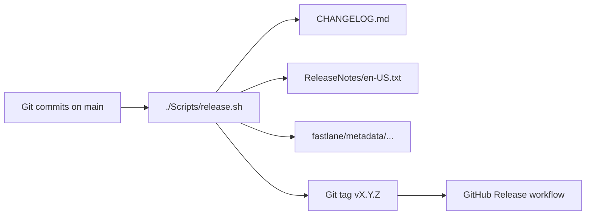

# Release pipeline

Automated changelog and App Store release note generation for Trinket, plus the
day-to-day verification gates and test-tier routing that agents and local
workflows use. Designed for agent-driven commits on `main` with release-boundary
automation (no per-commit manual changelog editing).

## Overview

Release artifact flow:


| Artifact | Audience | Generator |
|----------|----------|-----------|
| `CHANGELOG.md` | Developers, agents | `git-cliff` via `cliff.toml` (Keep a Changelog) |
| GitHub Release body | Contributors, QA | Same as changelog (`.github/workflows/release.yml`) |
| `ReleaseNotes/en-US.txt` | App Store / TestFlight | `./Scripts/release-notes-user.sh` |
| `fastlane/metadata/en-US/release_notes.txt` | Fastlane `deliver` (Phase 3) | Copied from `ReleaseNotes/en-US.txt` |

## Version source of truth

Marketing and build numbers live in `project.yml`:

```yaml
settings:
  base:
    MARKETING_VERSION: "0.1.0"       # semver, bumped at release
    CURRENT_PROJECT_VERSION: "1"     # build number, always increments
```

Run `./Scripts/generate.sh` after changing versions so XcodeGen picks them up.

## Commit message contract

Canonical commit format for agents and release parsers (`cliff.toml`, `validate-commit-msg.sh`). Agent workflow overview: `AGENTS.md`.

```
<type>(<scope>): <imperative subject ≤72 chars>

- <notable change>
- <another change>

User-Facing: yes | no
Breaking: <description if any>
```

**Types:** `feat`, `fix`, `perf`, `refactor`, `content`, `style`, `test`, `ci`, `chore`, `docs`

Imperative subjects without a type prefix (`Add session state restoration…`) are also
supported via regex parsers in `cliff.toml`.

Set `User-Facing: yes` when players would notice the change. Set `User-Facing: no` for
CI, style, refactor, and tooling-only work. If omitted, heuristics in
`release-notes-user.py` decide.

Agents do **not** edit `CHANGELOG.md` per commit. Release scripts generate it at tag time.

## Verification gates & test tiers

This section owns day-to-day task → script routing, gate composition, and tier inventory; `AGENTS.md` defers here for all of them.

### Confidence ladder

Pick the cheapest rung that matches the question you need answered. Higher rungs include lower ones' intent, not always their exact flags.

| Rung | Entry | Answers |
|------|-------|---------|
| Task handoff | `handoff.sh --isolate --paths …` | Did *these* paths stay green? (path-scoped; agents always use this) |
| Gate only | `ci-gate.sh` | Generate/assert vs HEAD + full-tree style + boundaries (no unit/UI) |
| Local CI canary | `test-deploy.sh --mode smoke` | Gate + unit + quick smoke |
| Deploy confidence | `test-deploy.sh` | Gate + unit + full UI |
| CI / main | `pr.yml` / `ci.yml` → `tests.yml` | Gate → build-once → unit + smoke-full (+ exhaustive UI) |

| Gate | Runs |
|------|------|
| `ci-gate.sh` | generate → assert (vs HEAD) → style → boundaries → build-input/cache-key path check → Swift Testing check → release-notes validate |
| `ci-assets-gate.sh` | generate `--assets` → assert → locale-stable regenerate (`en_US.UTF-8`) → assert (CI `assets-gate`) |
| `test-deploy.sh` | `ci-gate.sh` → unit → **full UI** (default) or quick smoke + timing (`--mode smoke`) — **local canary / explicit release confidence in one script** |
| GitHub `pr.yml` | Shared `tests.yml`: gate → one **build-for-testing** → parallel **unit**, **smoke-full**, and sharded **exhaustive UI** (DerivedData cache) on `macos-26` |
| GitHub `ci.yml` (main) | Same shared `tests.yml` fan-out with sharded exhaustive UI included |
| GitHub `nightly.yml` | gate → integration (`test.sh all`) + battle performance; DerivedData **restore-only** (PR/main `build` owns cache write-back) |

CI DerivedData warmth (`.github/actions/restore-and-build`): two-tier key from
`.github/actions/build-cache-key` (`build-<nonsource>-<full>` + nonsource prefix restore),
then `build-for-testing.sh --app-only`. The app scheme already compiles every package
as a dependency, so the build job is app-only: package-scheme builds happen on the
unit job (`test.sh unit` builds and runs all package schemes itself), keeping them off
the fan-out critical path shared by smoke/exhaustive UI. PR/main `build` also prunes
(Intermediates are stripped from the saved cache — the cache ships products for
`--no-build` test fan-out, it does not provide incremental compile state), saves on
miss, and uploads a within-run artifact. Nightly integration restores the same app-only
key but does **not** save — adding nightly save would mostly upload cost. Revisit only
if Nightlies start missing the warm prefix. Shared roots between local
`--no-build` freshness and the cache key are guarded by `./Scripts/check-build-cache-paths.sh`
(wired into `ci-gate.sh`).

| Tier | Command | When |
|------|---------|------|
| Unit | `test.sh unit` | Full local/CI confidence — all package schemes in parallel (TrinketTests carries no app-level unit tests, so no app build/plan runs) |
| Unit (app-only) | `test.sh unit --app-only` | Path-scoped verify — TrinketTests only (packages scheduled separately) |
| Unit (filtered) | `test.sh unit <Class>` | Focused app logic (`TrinketTests` only) |
| Package unit | `test-package.sh <Package>` | Focused package logic; BattleEngine balance-tool tests require `--include-balance-sweep-tests` |
| UI smoke canary | `test.sh smoke` | Optional local confidence — Homestead canary (`QuickSmoke.xctestplan`) |
| Targeted smoke | `test.sh smoke <Class…>` | One or more smoke classes in a **single** `xcodebuild` (`Smoke.xctestplan` + filters) |
| Full smoke | `test.sh smoke-full` | CI / PR only — full `Smoke.xctestplan` |
| Targeted UI | `test.sh ui <Class>` | Focused exhaustive UI iteration |
| Full UI | `test.sh ui` | CI / explicit full local confidence; CI shards by feature |
| Integration | `test.sh all` | Nightly / manual |
| Battle performance | `performance.sh` | Exclusive repeated full-fidelity matrix; nightly calibration |

For agent or local task handoffs, `./Scripts/agent-context.sh --agent --paths <file...>`
prints a compact briefing with applicable nested `AGENTS.md` guides, context
cards/skills, generated-output and boundary warnings, and the verification route.
Use `--json` for machine-readable output; large agent briefings group paths and
leave the complete list in JSON.
Without `--paths`, it reports the entire working tree, which is useful only when the
tree represents one task. Agents must run
`./Scripts/handoff.sh --isolate --paths <file...>` after the change stabilizes
(preview with `--dry-run`; use `--quiet` for PASS/FAIL plus bounded failure excerpts).
`--isolate` acquires a reusable agent simulator slot (`Trinket Agent N`) and
DerivedData under `.DerivedData/runs/agent-N/` via `Scripts/run-env.sh` so concurrent
agents do not share `build.db` or `Trinket CI`. Pool size is `TRINKET_MAX_AGENT_SIMS`
(default 1; one-at-a-time local agent). On self-clean start and EXIT, the top-level
owner (`trinket_run_env_self_clean_hygiene`) reclaims Xcode Preview sims when the
Preview device set is non-empty (shutdown only Booted; then delete), enforces
exactly one Booted managed sim (Agent or CI), and age-prunes bulky `.DerivedData`
artifacts plus package-local `.build` / `.DerivedData` (TestResults /
PerformanceResults / Logs; keeps warm `runs/agent-N` Build products). The keep-target
stays Booted — no routine erase. Nested children release leases only. Package
schemes use per-package DerivedData under `$DERIVED_DATA_PATH/packages/<name>/`
so package builds can run in parallel. Package xcodebuild also sets `SYMROOT` /
`OBJROOT` / `SHARED_PRECOMPS_DIR` under that tenant — SPM package schemes otherwise share
`Packages/.DerivedData/build.db` even when `-derivedDataPath` differs. Humans/CI may omit `--isolate` to keep
the shared warm cache.

Path-scoped `handoff.sh` is deterministic and sequential:
- Style is path-scoped to changed Swift files (full-tree style remains in `ci-gate` / CI).
- Touched packages are scheduled via `test-package.sh` (multi-package runs parallel
  across per-package DerivedData tenants, wall ≈ slowest package). Unit uses
  `--app-only`; packages are scheduled only when touched.
- A feature/UI path resolves to a targeted smoke canary when it has an owner
  (Battle → `SmokeBattleTests`, Homestead → `SmokeHomesteadTests`, Collection →
  `SmokeCollectionTests`, Play/Shop → `SmokeShopTests`/`SmokePlayTests`); otherwise
  the app-compile gap-fill (`build.sh`) covers it. AccessibilityID /
  PreparedArtworkCache route their Homestead smoke canaries; `smoke-full` on PR
  covers the five-surface matrix.
- No demotions: a diff that is only metrics/layout constants, SwiftUI chrome
  modifiers, SF Symbol swaps, or `Text("…")` copy runs the same routed package
  tests / smoke as any other Swift change.
- After generate, handoff asserts idempotently (regenerate is a no-op) and stamps
  `.last-generate.stamp` so fresh asserts skip a redundant regenerate.

After generation, handoff runs
`assert-generated-output.sh --idempotent` (regenerate must be a no-op) — not the
HEAD/commit check. Before commit, review and stage only the task's authored and
generated files after this check passes. After commit, commit completeness is
`./Scripts/agent-push-gate.sh` (also called from pre-push), `ci-gate.sh`, and CI.
If the post-commit gate regenerates files, review them, amend the commit, and rerun it.
`agent-push-gate.sh` is **generate/assert only** — not style or compile; path-scoped
`handoff.sh` remains the pre-CI source gate (and schedules compile-only
`build.sh` for feature/shared/model Swift when no unit/smoke owner resolves).
Post-push CI watching is owned by cloud agent automations; red-`main` recovery
policy for **CI Autofix — Trinket** and the Actions sticky **CI failing on main**
lives in [`Docs/CI-FIXER.md`](../Docs/CI-FIXER.md)
(Cursor: Tier A squash PR + auto-merge when no user-facing design judgment;
Actions: deterministic sticky **CI failing on main**).
`./Scripts/agent-watch-ci.sh` remains available for manual use (auto-dispatches
full CI when path filters skipped substantive jobs; on failure prints check
annotations plus a short log excerpt; simulator/XCUITest launch flakes get one
`gh run rerun --failed` via `./Scripts/ci-infra-rerun.sh`). Nightly uses the same
classifier from `.github/workflows/nightly-infra-rerun.yml` for a single attempt-1
infra retry; real (non-infra) failures create or update a "Nightly failing on main"
issue. Nightly skips its expensive jobs when HEAD already passed the last
successful run.
Task-scoped verification is the routine local source gate. Full local confidence
runs remain available for release or high-risk changes, while PR/main CI owns the
broad smoke and exhaustive UI coverage.

Every completed `handoff.sh` and `agent-push-gate.sh` run prints an advisory
`change-budget.sh` report against HEAD: authored production/test/docs-tool LOC,
new Swift files and types, and test declaration deltas. Generated output is excluded.
Warnings never fail the change; agents explain the necessity and simpler rejected
alternative. Declaration counts do not include expanded `@Test(arguments:)` cases;
inspect runtime with `./Scripts/test-timing.sh` when deliberately hunting slow tests.

Local iteration speed comes from **path-scoped verify** (touched packages, targeted smoke) —
targeted smoke)—not from reading timing reports. Full `test.sh unit`, `smoke-full`,
and FullUI remain CI or explicit confidence runs. `test.sh` and `test-package.sh`
append to `.DerivedData/TestResults/timing-log.jsonl` (`unit` / `smoke` / …
and `package:<Name>`). Inspect on demand, e.g.
`./Scripts/test-timing.sh report --mode package:TrinketAppState`. Agents do **not**
act on timing output during normal feature work.

`test.sh` runs the generation preflight, then builds and tests (unless `--no-build`).
Bare `test.sh unit` runs the package schemes only — `TrinketTests` declares no test
cases (only Swift Testing tag definitions), so building the app for an empty plan is
skipped. `test.sh unit --app-only` (path-scoped verify) and `test.sh unit <Class>`
still build the app. Set `TRINKET_RECORD_TIMING=0` to skip timing-log recording in
tight local loops (CI keeps it on).
Generation uses a shared lock (timeout via `TRINKET_GENERATE_LOCK_TIMEOUT_SECONDS`,
default 120). Isolated runs take an agent sim slot; UI/smoke modes also take a fail-fast
UI concurrency slot (`TRINKET_MAX_CONCURRENT_UI`, default 2). XcodeGen uses its cache so
unchanged project inputs do not rewrite the project, and Swift under `Trinket/App`,
`Features`, `Models`, `Shared`, and related roots are synchronized folders so ordinary
source-file additions do not require regeneration. Asset catalogs, `Media/`, and
`AppIcon.icon` are explicit resource entries (not part of those sync roots) so actool
and audio churn stay isolated from Swift folder sync. CI reports timing regressions from per-run artifacts, but does not fail a
passing suite solely because hosted-runner session overhead exceeds a wall-clock budget.
`run-simulator.sh` (the `run` alias's build-to-launch path) builds quietly into a per-run
log and uses `-parallelizeTargets` + `-disableAutomaticPackageResolution` to speed warm
rebuilds; condensed `--verbose` output is available when `xcbeautify` (pinned via
`ensure-ci-tools.sh`) is on `.tools`.
Pin format/lint/XcodeGen with `./Scripts/ensure-ci-tools.sh`. Warm `agent-N` run dirs are
kept; one-off legacy run dirs under `.DerivedData/runs/` are pruned by
`./Scripts/prune-derived-data-cache.sh` (age via `TRINKET_RUN_MAX_AGE_DAYS`, default 3;
Intermediate/compilation-cache wipe only when `CI=true` or `--ci`).
That script never mutates simulator devices — Preview reclaim, single-warm Booted
enforcement, and age-prune live in `Scripts/run-env.sh` self-clean start + EXIT
on verify/test. The keep-target managed sim stays Booted; excess managed Booted
sims are shut down quietly; managed sims are never erased on the normal path.
`xcode-runner.sh` wall/idle watchdogs (`TRINKET_XCODE_WALL_TIMEOUT_SECONDS` /
`TRINKET_XCODE_IDLE_TIMEOUT_SECONDS`, default idle 45s) kill hung **host**
xcodebuild trees only — they never call `simctl`. Idle arms on XCTest
`Selected tests`/`All tests` completion (not only `** TEST SUCCEEDED **`) so
post-suite simulator-diagnostics hangs do not burn Xcode's ~600s wait.
Parallel source trees: `./Scripts/agent-worktree.sh create <slug>`.

### Local Mac setup (simulator CrashReporter)

MobileCal / Widget / PosterBoard “quit unexpectedly” sheets after intentional
`simctl` teardown are Simulator host noise, not Trinket test failures. Do this
once per development Mac:

1. Download **Additional Tools for Xcode** from
   [developer.apple.com/download/all](https://developer.apple.com/download/all/?q=Additional%20Tools)
   (or **Xcode → Open Developer Tool → More Developer Tools…**). Match your Xcode
   major version.
2. Mount the disk image → **Utilities** → open **CrashReporterPrefs**.
3. Set **Basic** (keeps real app crash dialogs; silences guest-daemon teardown spam).
4. Log out/in or reboot so the preference applies.

Do **not** unload ReportCrash system-wide. Erase stays a recovery path only
(`ensure-simulator` force / failed cold-boot retry); happy-path self-clean shuts
down excess managed sims and reclaims non-empty Preview sets via
`trinket_sim_shutdown_wait` (PosterBoard stop + wait) — never routine erase.

### Simulator process rules

- Agents: always `--isolate`; never ad-hoc `simctl erase` / `shutdown all`.
- Humans: warm shared `Trinket CI` for day-to-day; close SwiftUI Canvas / Previews
  before long verify runs (Booted Preview devices force reclaim shutdown/delete).
  Set `TRINKET_CLEANUP_PREVIEW_SIMS=0` only when you intentionally keep Preview
  devices alive mid-session.
- Investigate CrashReporter sheets only when they appear without a recent
  `simctl` teardown, or alongside real boot/test failures.

### Xcode IDE loop (human day-to-day)

Trinket’s rebuild cost is mostly local-SPM fan-out from `TrinketContent`, asset
catalog work, and cache fragmentation — not Always-Out-Of-Date Run Scripts (there
are none; codegen is external via `generate.sh`).

1. **Share build products with scripts.** File → Workspace Settings… → Build
   Location → **Custom** → **Relative to Workspace**, then set:
   - Products: `.DerivedData/Build/Products`
   - Intermediates: `.DerivedData/Build/Intermediates.noindex`
   That matches `xcodebuild -derivedDataPath .DerivedData` used by
   `./Scripts/build.sh` / `./Scripts/test.sh`. Do not use plain `Build/Products`
   (creates an unignored `Build/` at the workspace root). Absolute paths to the
   same folders under this repo are equivalent for one checkout. Leave global
   Xcode → Settings → Locations → Derived Data on the default unless you also
   want indexing/other IDE caches under the repo. Agents keep `--isolate`
   (`.DerivedData/runs/agent-N/`); humans omit `--isolate` for the shared warm tree.
2. **Do not run `./Scripts/generate.sh --assets` while iterating Swift UI** unless
   manifests or raw art/music/SFX/cinematics changed. Content-only: `./Scripts/generate.sh`
   once, then leave Xcode alone. Asset prepare scripts skip rewriting unchanged
   catalogs / hash TSVs / `Assets.xcassets/Contents.json` so no-op `--assets` does
   not invalidate actool.
3. **Prefer scoped loops:** `./Scripts/test-package.sh <Package>`,
   `./Scripts/test.sh unit --app-only`, or `./Scripts/test-iterate.sh <Class>`.
   Avoid bare `./Scripts/test.sh unit` (builds the app, then rebuilds every package
   scheme in separate tenants). For app launch, `./Scripts/run-simulator.sh` uses
   `-parallelizeTargets`, `-disableAutomaticPackageResolution`, and
   `COMPILER_INDEX_STORE_ENABLE=NO`.
4. **Close SwiftUI Canvas / Previews** when not actively tuning Labs — Previews
   rebuild local packages aggressively, and Booted Preview devices are what
   self-clean must `simctl shutdown` (empty Preview sets are skipped). Avoid a
   second Xcode window on a nested
   `Package.swift` while the app project is open (that creates
   `Packages/*/.DerivedData` / `.build`); delete those trees if they accumulate.
   Self-clean also removes shared `Packages/.DerivedData` (a parallel package-test
   lock hazard).
5. **Skip local `ci-gate.sh` / push-gate during tight iteration** — they
   `--force-xcodegen` and reindex. Use path-scoped `handoff.sh` instead.
   When `.DerivedData` grows large, `./Scripts/prune-derived-data-cache.sh`
   (local mode keeps Build/Intermediates).

`performance.sh` is intentionally separate from smoke and integration gates. It takes an
exclusive Battle-performance lock, forces one UI lane, runs `BattlePerformance.xctestplan`
with one measured report per scenario by default, collects raw frame reports, and compares
them with the observe/enforce policy in `Performance/Baselines/simulator-60.json`
(`observe` reports findings without failing the job; `enforce` exits non-zero on misses).
Nightly stays in `observe` until hosted Simulator consistently clears the goals. Override
repetitions for diagnostic spreads with `TRINKET_PERFORMANCE_REPETITIONS=N` (skips the
single-report gate compare when N > 1). Use `test.sh performance <Class[/method]>`
only for focused harness iteration; use `performance.sh` for comparable artifacts.
For fast Battle isolation loops, prefix with `TRINKET_PERFORMANCE_QUICK=1` (shorter
measure window / UITest wait; not for gate compares). `test.sh` maps this through
`TEST_RUNNER_TRINKET_PERFORMANCE_QUICK` so XCTest and the app under test both see it.

For failure report schemas and triage order, read
`Docs/AgentContext/ci-diagnostics.md`. Operators can aggregate current reports with
`./Scripts/ci-diagnostics.sh .DerivedData/TestResults` (or the isolated
`.DerivedData/runs/agent-N/TestResults`) or clear cached status and
diagnostic artifacts with `./Scripts/ci-diagnostics.sh --reset
.DerivedData/TestResults`. Consume the structured aggregate and per-invocation reports
before raw xcodebuild logs; an `unknown` category is the explicit escalation path.
CI keeps the existing `test.sh`/`test-package.sh` scopes and omits `--verbose` so
structured reports remain the primary actionable output while raw logs stay available
as artifacts.

### Toolchain ladder (cloud / no Xcode 26)

Local and CI expect **Xcode 26+**. Without the simulator toolchain:

1. Land correct source/docs changes.
2. Run what you can: `./Scripts/generate.sh`, `./Scripts/assert-generated-output.sh` (commit check) or `--idempotent` after a local generate, `./Scripts/check-module-boundaries.sh`, `./Scripts/check-ui-style.sh`, `./Scripts/ci-gate.sh`.
3. Skip `build.sh` / `test.sh` / simulator work — state that clearly in the commit/PR body.
4. When Xcode 26 + simulator **are** present, `build.sh` / `test.sh` (per the tier table above) are mandatory before claiming the change is verified.

## Commands

| Script | Purpose |
|--------|---------|
| `./Scripts/agent-push-gate.sh` | Pinned tools + `generate --force-xcodegen` + assert vs HEAD (conditional `--assets`); agents after commit, before push |
| `./Scripts/agent-watch-ci.sh` | Watch Actions for HEAD; dispatch full CI if path-filtered; manual/optional (cloud automations own post-push watch) |
| `./Scripts/ci-infra-rerun.sh` | Classify simulator/XCUITest infra failures; optional `gh run rerun --failed` |
| `./Scripts/ensure-git-cliff.sh` | Install/run git-cliff (cached in `.tools/`) |
| `./Scripts/release-notes.sh unreleased` | Preview unreleased changelog |
| `./Scripts/release-notes.sh prepend v0.2.0` | Prepend version section to `CHANGELOG.md` |
| `./Scripts/release-notes.sh bump` | Print suggested next semver |
| `./Scripts/release-notes.sh validate` | Verify `cliff.toml` parses history |
| `./Scripts/release-notes-user.sh` | Generate App Store notes + `.prompt.md` |
| `./Scripts/release.sh` | Full release orchestration |
| `./Scripts/validate-commit-msg.sh` | Advisory commit message check |
| `./Scripts/agent-context.sh [--agent\|--json] [--paths <file...>]` | Emit a compact task context briefing and verification plan |
| `./Scripts/change-budget.sh [--paths <file...>]` | Advisory authored LOC/file/type/test-declaration delta report against HEAD |
| `./Scripts/handoff.sh [--dry-run] [--quiet] [--isolate] [--paths <file...>]` | Deterministic sequential task gate; `--quiet` bounds output; agents always pass `--isolate` |
| `./Scripts/agent-worktree.sh create\|list\|remove <slug>` | Sibling git worktree for parallel agent checkouts |
| `./Scripts/ci-diagnostics.sh [--reset] [RESULTS_DIR]` | Aggregate current invocation diagnostics or clear cached status artifacts |
| `./Scripts/balance-sweep.sh` | Headless battle balance sweep → `BalanceSweepReports/*.md` |

### Typical release flow

```sh
# Preview
./Scripts/release.sh --dry-run

# Ship (runs test-deploy.sh, bumps version, commits, tags)
./Scripts/release.sh

# Push when ready
git push origin main --tags
```

Options:

- `--version X.Y.Z` — explicit semver instead of auto-bump
- `--skip-tests` — skip deploy gate (avoid except emergencies)
- `--no-tag` — commit release assets without tagging

Pushing a `v*` tag triggers `.github/workflows/release.yml`, which verifies the
tagged commit is on `main` with a green Trinket CI run (waiting for it when main
and the tag are pushed together), then creates a GitHub Release and uploads App
Store note artifacts. The full test suite is not re-run at tag time — `release.sh`
runs `test-deploy.sh` before tagging and the main push runs full CI.

## Style & lint ownership

`./Scripts/test.sh style` runs five complementary checks. Do not blur their roles.
The style mode **fails closed**: any non-zero SwiftFormat / SwiftLint / UI style /
platform-ban / exclusivity exit fails the gate (matching CI).

| Tool | Config | Owns |
|------|--------|------|
| SwiftFormat | `.swiftformat` | Whitespace, trailing commas, import order, trailing newlines, brace/wrap layout, preference rewrites (`isEmpty`, `preferContains`, Swift Testing / private `@State`, …) |
| SwiftLint | `.swiftlint.yml` | Semantics, API idioms, structural size, force unwrap/cast/try; macOS custom_rules for platform bans. Analyzer rules (`unused_import`) need `swiftlint analyze` + a compiler index and are **not** in this gate. `no_empty_block` stays off (Codable empty inits, SwiftUI dismiss buttons, no-op defaults). On GitHub Actions, `lint.sh` uses dual reporters (`xcode` + `github-actions-logging`) so job logs and Checks annotations both show rule/file/line. Linux portable builds skip SourceKit custom_rules — treat style PASS there as provisional vs CI. |
| UI style | `Scripts/check-ui-style.sh` | Product chrome **and colors** — glass/material/button styles, raw RGB/`UIColor`/`#colorLiteral`, SwiftUI system color literals, app-bundle/`Color("…")` names, and `.accentColor`; route through `TrinketDesign` |
| Platform bans | `Scripts/check-platform-api-bans.sh` | `NavigationView` / `ObservableObject` / `@Published` / `@StateObject` / `@EnvironmentObject` / `@ObservedObject` (SourceKit-free) |
| Exclusivity | `Scripts/check-exclusivity-footguns.sh` | `inout` of `self.` / likely stored properties without a local copy (`ExclusivityCheck: allow`) |

Pinned versions live in `Scripts/tool-versions.env`. Shared format/lint roots live in `Scripts/swift-source-dirs.env` (app, packages, package tests, `TrinketTestSupport`). Install with `./Scripts/ensure-ci-tools.sh`. Module layering is a separate gate: `./Scripts/check-module-boundaries.sh`.

The app-wide palette is centralized in `TrinketDesignSystem`: feature views use `TrinketDesign.Colors`, keyword/homestead/resource helpers, and hero scrim APIs instead of `Color(red:green:blue:)`, SwiftUI system colors (`Color.green`, `.foregroundStyle(.white)`, `Color.accentColor`, …), app-bundle `Color("…", bundle: .main)`, or `.accentColor`. Adaptive `Color.primary` / `.secondary` / `.clear` remain allowed for text/chrome. Domain colors (keywords, encounters, resources) still live as named assets in `DesignColors.xcassets`. Reserve `UIStyleCheck: allow` for narrowly scoped exceptions with a nearby reason.

## Configuration files

| File | Role |
|------|------|
| `.swiftformat` / `.swiftlint.yml` | Format + semantic lint (see Style & lint ownership) |
| `Scripts/swift-source-dirs.env` | Shared Swift roots for `format.sh` / `lint.sh`, plus `TRINKET_TEST_PACKAGES` |
| `cliff.toml` | Developer changelog (Keep a Changelog categories) |
| `cliff-appstore.toml` | Alternate git-cliff template (plain bullets) |
| `ReleaseNotes/.prompt.md` | Generated prompt for optional AI polish (gitignored) |

## App Store guidance (Apple)

Apple documents the **What's New in this Version** field in
[Platform version information](https://developer.apple.com/help/app-store-connect/reference/app-information/platform-version-information/):

- Required for every update after the first App Store version
- Up to 4,000 characters, plain text, localizable
- Apple recommends specific, user-meaningful descriptions

Apple does not provide Swift or Xcode changelog tooling. Trinket uses git-cliff plus a
user-facing rewrite step (`release-notes-user.py`) to satisfy store requirements.

`release-notes-user.sh` validates the 4,000-character limit and warns when the summary
line exceeds ~150 characters (mobile truncation point).

## Optional AI polish

After `./Scripts/release.sh`, read `ReleaseNotes/.prompt.md` and ask an agent to rewrite
the draft in `ReleaseNotes/en-US.txt` for player-facing tone. Re-run validation:

```sh
wc -c ReleaseNotes/en-US.txt   # must be ≤ 4000
```

Then amend the release commit or commit the polished notes before pushing the tag.

## Phase 3: TestFlight / App Store automation

When ready to ship builds:

1. Add Fastlane with `deliver` reading `fastlane/metadata/en-US/release_notes.txt`
2. Store an App Store Connect API key in GitHub secrets
3. Extend `release.yml` with a macOS job: build → TestFlight upload → set metadata

See [Create a new version](https://developer.apple.com/help/app-store-connect/update-your-app/create-a-new-version)
and [Creating Your Product Page](https://developer.apple.com/app-store/product-page/) for
Apple's store-side workflow.

## Commit message hook (optional)

Install locally for advisory warnings:

```sh
git config core.hooksPath .githooks
```

The repo includes:

- `.githooks/commit-msg` → `./Scripts/validate-commit-msg.sh` (advisory)
- `.githooks/pre-push` → `./Scripts/test.sh style` + `./Scripts/agent-push-gate.sh` (pinned XcodeGen force generate + assert vs HEAD; conditional assets)

Install pinned SwiftFormat/SwiftLint/XcodeGen with `./Scripts/ensure-ci-tools.sh` (versions in `Scripts/tool-versions.env`). Skip the pre-push gate once with `SKIP_TRINKET_PREPUSH=1`. Skip only the generate/assert half with `SKIP_TRINKET_PUSH_GATE=1`. For the full local CI gate without unit/quick-smoke, run `./Scripts/ci-gate.sh`. Commit-msg warnings are advisory and do not block commits.
