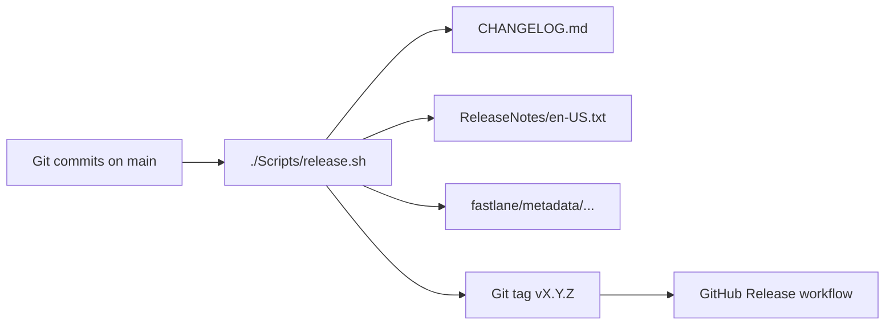

# Release pipeline

Automated changelog and App Store release note generation for Trinket, plus the
day-to-day verification gates and test-tier routing that agents and local
workflows use. Designed for agent-driven commits on `main` with release-boundary
automation (no per-commit manual changelog editing).

## Overview

Release artifact flow:


| Artifact | Audience | Generator |
|----------|----------|-----------|
| `CHANGELOG.md` | Developers, agents | `git-cliff` via `cliff.toml` (Keep a Changelog) |
| GitHub Release body | Contributors, QA | Same as changelog (`.github/workflows/release.yml`) |
| `ReleaseNotes/en-US.txt` | App Store / TestFlight | `./Scripts/release-notes-user.sh` |
| `fastlane/metadata/en-US/release_notes.txt` | Fastlane `deliver` (Phase 3) | Copied from `ReleaseNotes/en-US.txt` |

## Version source of truth

Marketing and build numbers live in `project.yml`:

```yaml
settings:
  base:
    MARKETING_VERSION: "0.1.0"       # semver, bumped at release
    CURRENT_PROJECT_VERSION: "1"     # build number, always increments
```

Run `./Scripts/generate.sh` after changing versions so XcodeGen picks them up.

## Commit message contract

Canonical commit format for agents and release parsers (`cliff.toml`, `validate-commit-msg.sh`). Agent workflow overview: `AGENTS.md`.

```
<type>(<scope>): <imperative subject ≤72 chars>

- <notable change>
- <another change>

User-Facing: yes | no
Breaking: <description if any>
```

**Types:** `feat`, `fix`, `perf`, `refactor`, `content`, `style`, `test`, `ci`, `chore`, `docs`

Imperative subjects without a type prefix (`Add session state restoration…`) are also
supported via regex parsers in `cliff.toml`.

Set `User-Facing: yes` when players would notice the change. Set `User-Facing: no` for
CI, style, refactor, and tooling-only work. If omitted, heuristics in
`release-notes-user.py` decide.

Agents do **not** edit `CHANGELOG.md` per commit. Release scripts generate it at tag time.

## Verification gates & test tiers

This section owns day-to-day task → script routing, gate composition, and tier inventory; `AGENTS.md` defers here for all of them.

| Gate | Runs |
|------|------|
| `ci-gate.sh` | generate → assert (vs HEAD) → boundaries → Swift Testing check → style → release-notes validate |
| `ci-locally.sh` | `ci-gate.sh` → unit → quick smoke (+ timing reports) — **optional full local confidence run** |
| `test-deploy.sh` | `ci-gate.sh` → unit → full UI — **explicit release/pre-merge confidence run** |
| GitHub `pr.yml` | Shared `tests.yml`: gate → one **build-for-testing** → parallel **unit**, **smoke-full**, and sharded **exhaustive UI** (DerivedData cache) on `macos-26` |
| GitHub `ci.yml` (main) | Same shared `tests.yml` fan-out with sharded exhaustive UI included |

| Tier | Command | When |
|------|---------|------|
| Unit | `test.sh unit` | Full local/CI confidence — TrinketTests **plus all package schemes** |
| Unit (app-only) | `test.sh unit --app-only` | Path-scoped verify — TrinketTests only (packages scheduled separately) |
| Unit (filtered) | `test.sh unit <Class>` | Focused app logic (`TrinketTests` only) |
| Package unit | `test-package.sh <Package>` | Focused package logic; BattleEngine balance-tool tests require `--include-balance-sweep-tests` |
| UI smoke canary | `test.sh smoke` | Optional local confidence — Homestead canary (`QuickSmoke.xctestplan`) |
| Targeted smoke | `test.sh smoke <Class…>` | One or more smoke classes in a **single** `xcodebuild` (`Smoke.xctestplan` + filters) |
| Full smoke | `test.sh smoke-full` | CI / PR only — full `Smoke.xctestplan` |
| Targeted UI | `test.sh ui <Class>` | Focused exhaustive UI iteration |
| Full UI | `test.sh ui` | CI / explicit full local confidence; CI shards by feature |
| Integration | `test.sh all` | Nightly / manual |
| Battle performance | `performance.sh` | Exclusive repeated full-fidelity matrix; nightly calibration |

For agent or local task handoffs, `./Scripts/agent-context.sh --agent --paths <file...>`
prints a compact briefing with applicable nested `AGENTS.md` guides, context
cards/skills, generated-output and boundary warnings, and the verification route.
Use `--json` for machine-readable output; large agent briefings group paths and
leave the complete list in JSON.
Without `--paths`, it reports the entire working tree, which is useful only when the
tree represents one task. Agents must run
`./Scripts/verify-changed.sh --isolate --paths <file...>` after the change stabilizes
(preview with `--dry-run`; use `--quiet` for PASS/FAIL plus bounded failure excerpts).
`--isolate` acquires a reusable agent simulator slot (`Trinket Agent N`) and
DerivedData under `.DerivedData/runs/agent-N/` via `Scripts/run-env.sh` so concurrent
agents do not share `build.db` or `Trinket CI`. Pool size is `TRINKET_MAX_AGENT_SIMS`
(default 3). Isolate defaults `TRINKET_CLEANUP_EXCESS_SIMULATORS=0` so agent sims stay
warm across runs; set it to `1` to shut down excess managed sims after a run. Shared
`Trinket CI` and agent simulators held by another active run are never shut down.
Package schemes use per-package DerivedData under `$DERIVED_DATA_PATH/packages/<name>/`
so package builds can run in parallel. Humans/CI may omit `--isolate` to keep
the shared warm cache.

Path-scoped verify optimizations (local gate, not a coverage reduction for CI):
- Style is path-scoped to changed Swift files (full-tree style remains in `ci-gate` / CI).
- Style and touched-package tests may run in parallel; multi-package and multi-smoke
  targets are batched into one invocation each.
- Unit steps use `--app-only` (no 9-package fan-out); packages are scheduled only when
  touched.
- AccessibilityID renames route package tests + Homestead smoke canary locally;
  `smoke-full` on PR covers the five-surface matrix.
- BattleFeature DEBUG labs (`*Lab*`, `*Playground*`, `*EffectVariants*`) are package-only
  locally; shipping battle UI still routes `SmokeBattleTests`.
- After generate, verify stamps `.last-generate.stamp` and skips redundant regenerate in
  children / fresh idempotent asserts. Stage walls append to
  `$RESULTS_DIR/verify-timing.jsonl`.

After generation, verify-changed runs
`assert-generated-output.sh --idempotent` (regenerate must be a no-op, or skipped when
the generate stamp is still fresh) — not the
HEAD/commit check. Before commit, review and stage only the task's authored and
generated files after this check passes. After commit, commit completeness is
`./Scripts/agent-push-gate.sh` (also called from pre-push),
`verify-changed.sh --push-ready`, `ci-gate.sh`, and CI. If the post-commit gate
regenerates files, review them, amend the commit, and rerun it.
Push-gate is **generate/assert only** — not style or compile; path-scoped
`verify-changed.sh` remains the pre-CI source gate (and schedules compile-only
`build.sh` for feature/shared/model Swift when no unit/smoke owner resolves).
After push, agents run `./Scripts/agent-watch-ci.sh` (auto-dispatches full CI when
path filters skipped substantive jobs; on failure prints check annotations plus a
short log excerpt; simulator/XCUITest launch flakes get one `gh run rerun --failed`
via `./Scripts/ci-infra-rerun.sh`). Nightly uses the same classifier from
`.github/workflows/nightly-infra-rerun.yml` for a single attempt-1 infra retry;
real (non-infra) failures create or update a "Nightly failing on main" issue.
Nightly skips its expensive jobs when HEAD already passed the last successful run.
Task-scoped verification is the routine local source gate. Full local confidence
runs remain available for release or high-risk changes, while PR/main CI owns the
broad smoke and exhaustive UI coverage.

Every completed `verify-changed.sh` and `agent-push-gate.sh` run prints an advisory
`change-budget.sh` report against HEAD: authored production/test/docs-tool LOC,
new Swift files and types, and test declaration deltas. Generated output is excluded.
Warnings never fail the change; agents explain the necessity and simpler rejected
alternative. Declaration counts do not include expanded `@Test(arguments:)` cases,
so use `test-timing.sh` for runtime decisions.

`test.sh` runs the generation preflight, then builds and tests (unless `--no-build`).
Generation uses a shared lock (timeout via `TRINKET_GENERATE_LOCK_TIMEOUT_SECONDS`,
default 120). Isolated runs take an agent sim slot; UI/smoke modes also take a fail-fast
UI concurrency slot (`TRINKET_MAX_CONCURRENT_UI`, default 2). XcodeGen uses its cache so
unchanged project inputs do not rewrite the project, and the app/test source roots are
Xcode synchronized folders so ordinary source-file additions and deletions do not require
regeneration. CI reports timing regressions from per-run artifacts, but does not fail a
passing suite solely because hosted-runner session overhead exceeds a wall-clock budget.
`run-simulator.sh` (the `run` alias's build-to-launch path) builds quietly into a per-run
log and uses `-parallelizeTargets` + `-disableAutomaticPackageResolution` to speed warm
rebuilds; condensed `--verbose` output is available when `xcbeautify` (pinned via
`ensure-ci-tools.sh`) is on `.tools`.
Pin format/lint/XcodeGen with `./Scripts/ensure-ci-tools.sh`. Warm `agent-N` run dirs are
kept; one-off legacy run dirs under `.DerivedData/runs/` are pruned by
`./Scripts/prune-derived-data-cache.sh` (age via `TRINKET_RUN_MAX_AGE_DAYS`, default 3;
Intermediate/compilation-cache wipe only when `CI=true` or `--ci`).
That script never mutates simulator devices — simulator lifecycle stays in
`ensure-simulator.sh`. Parallel source trees:
`./Scripts/agent-worktree.sh create <slug>`.

`performance.sh` is intentionally separate from smoke and integration gates. It takes an
exclusive Battle-performance lock, forces one UI lane, runs `BattlePerformance.xctestplan`
with one measured report per scenario by default, collects raw frame reports, and compares
them with the observe/enforce policy in `Performance/Baselines/simulator-60.json`. Override
repetitions for diagnostic spreads with `TRINKET_PERFORMANCE_REPETITIONS=N` (skips the
single-report gate compare when N > 1). Use `test.sh performance <Class[/method]>`
only for focused harness iteration; use `performance.sh` for comparable artifacts.
For fast Battle isolation loops, prefix with `TRINKET_PERFORMANCE_QUICK=1` (shorter
measure window / UITest wait; not for gate compares). `test.sh` maps this through
`TEST_RUNNER_TRINKET_PERFORMANCE_QUICK` so XCTest and the app under test both see it.

For failure report schemas and triage order, read
`Docs/AgentContext/ci-diagnostics.md`. Operators can aggregate current reports with
`./Scripts/ci-diagnostics.sh .DerivedData/TestResults` (or the isolated
`.DerivedData/runs/agent-N/TestResults`) or clear cached status and
diagnostic artifacts with `./Scripts/ci-diagnostics.sh --reset
.DerivedData/TestResults`. Consume the structured aggregate and per-invocation reports
before raw xcodebuild logs; an `unknown` category is the explicit escalation path.
CI keeps the existing `test.sh`/`test-package.sh` scopes and omits `--verbose` so
structured reports remain the primary actionable output while raw logs stay available
as artifacts.

### Toolchain ladder (cloud / no Xcode 26)

Local and CI expect **Xcode 26+**. Without the simulator toolchain:

1. Land correct source/docs changes.
2. Run what you can: `./Scripts/generate.sh`, `./Scripts/assert-generated-output.sh` (commit check) or `--idempotent` after a local generate, `./Scripts/check-module-boundaries.sh`, `./Scripts/check-ui-style.sh`, `./Scripts/ci-gate.sh`.
3. Skip `build.sh` / `test.sh` / simulator work — state that clearly in the commit/PR body.
4. When Xcode 26 + simulator **are** present, `build.sh` / `test.sh` (per the tier table above) are mandatory before claiming the change is verified.

## Commands

| Script | Purpose |
|--------|---------|
| `./Scripts/agent-push-gate.sh` | Pinned tools + `generate --force-xcodegen` + assert vs HEAD (conditional `--assets`); agents after commit, before push |
| `./Scripts/agent-watch-ci.sh` | Watch Actions for HEAD; dispatch full CI if path-filtered; agents after push |
| `./Scripts/ci-infra-rerun.sh` | Classify simulator/XCUITest infra failures; optional `gh run rerun --failed` |
| `./Scripts/ensure-git-cliff.sh` | Install/run git-cliff (cached in `.tools/`) |
| `./Scripts/release-notes.sh unreleased` | Preview unreleased changelog |
| `./Scripts/release-notes.sh prepend v0.2.0` | Prepend version section to `CHANGELOG.md` |
| `./Scripts/release-notes.sh bump` | Print suggested next semver |
| `./Scripts/release-notes.sh validate` | Verify `cliff.toml` parses history |
| `./Scripts/release-notes-user.sh` | Generate App Store notes + `.prompt.md` |
| `./Scripts/release.sh` | Full release orchestration |
| `./Scripts/validate-commit-msg.sh` | Advisory commit message check |
| `./Scripts/agent-context.sh [--agent\|--json] [--paths <file...>]` | Emit a compact task context briefing and verification plan |
| `./Scripts/changed-source-summary.sh [--paths <file...>]` | Summarize task-scoped or working-tree changes and focused agent route |
| `./Scripts/change-budget.sh [--paths <file...>]` | Advisory authored LOC/file/type/test-declaration delta report against HEAD |
| `./Scripts/verify-changed.sh [--dry-run] [--quiet] [--isolate] [--push-ready] [--paths <file...>]` | Run the minimum sequential verification; `--quiet` bounds output; agents always pass `--isolate` |
| `./Scripts/agent-worktree.sh create\|list\|remove <slug>` | Sibling git worktree for parallel agent checkouts |
| `./Scripts/ci-diagnostics.sh [--reset] [RESULTS_DIR]` | Aggregate current invocation diagnostics or clear cached status artifacts |
| `./Scripts/balance-sweep.sh` | Headless battle balance sweep → `BalanceSweepReports/*.md` |

### Typical release flow

```sh
# Preview
./Scripts/release.sh --dry-run

# Ship (runs test-deploy.sh, bumps version, commits, tags)
./Scripts/release.sh

# Push when ready
git push origin main --tags
```

Options:

- `--version X.Y.Z` — explicit semver instead of auto-bump
- `--skip-tests` — skip deploy gate (avoid except emergencies)
- `--no-tag` — commit release assets without tagging

Pushing a `v*` tag triggers `.github/workflows/release.yml`, which verifies the
tagged commit is on `main` with a green Trinket CI run (waiting for it when main
and the tag are pushed together), then creates a GitHub Release and uploads App
Store note artifacts. The full test suite is not re-run at tag time — `release.sh`
runs `test-deploy.sh` before tagging and the main push runs full CI.

## Style & lint ownership

`./Scripts/test.sh style` runs five complementary checks. Do not blur their roles.
The style mode **fails closed**: any non-zero SwiftFormat / SwiftLint / UI style /
platform-ban / exclusivity exit fails the gate (matching CI).

| Tool | Config | Owns |
|------|--------|------|
| SwiftFormat | `.swiftformat` | Whitespace, trailing commas, import order, trailing newlines, brace/wrap layout, preference rewrites (`isEmpty`, `preferContains`, Swift Testing / private `@State`, …) |
| SwiftLint | `.swiftlint.yml` | Semantics, API idioms, structural size, force unwrap/cast/try; macOS custom_rules for platform bans. Analyzer rules (`unused_import`) need `swiftlint analyze` + a compiler index and are **not** in this gate. `no_empty_block` stays off (Codable empty inits, SwiftUI dismiss buttons, no-op defaults). On GitHub Actions, `lint.sh` uses dual reporters (`xcode` + `github-actions-logging`) so job logs and Checks annotations both show rule/file/line. Linux portable builds skip SourceKit custom_rules — treat style PASS there as provisional vs CI. |
| UI style | `Scripts/check-ui-style.sh` | Product chrome **and colors** — glass/material/button styles, raw RGB/`UIColor`/`#colorLiteral`, SwiftUI system color literals, app-bundle/`Color("…")` names, and `.accentColor`; route through `TrinketDesign` |
| Platform bans | `Scripts/check-platform-api-bans.sh` | `NavigationView` / `ObservableObject` / `@Published` / `@StateObject` / `@EnvironmentObject` / `@ObservedObject` (SourceKit-free) |
| Exclusivity | `Scripts/check-exclusivity-footguns.sh` | `inout` of `self.` / likely stored properties without a local copy (`ExclusivityCheck: allow`) |

Pinned versions live in `Scripts/tool-versions.env`. Shared format/lint roots live in `Scripts/swift-source-dirs.env` (app, packages, package tests, `TrinketTestSupport`). Install with `./Scripts/ensure-ci-tools.sh`. Module layering is a separate gate: `./Scripts/check-module-boundaries.sh`.

The app-wide palette is centralized in `TrinketDesignSystem`: feature views use `TrinketDesign.Colors`, keyword/homestead/resource helpers, and hero scrim APIs instead of `Color(red:green:blue:)`, SwiftUI system colors (`Color.green`, `.foregroundStyle(.white)`, `Color.accentColor`, …), app-bundle `Color("…", bundle: .main)`, or `.accentColor`. Adaptive `Color.primary` / `.secondary` / `.clear` remain allowed for text/chrome. Domain colors (keywords, encounters, resources) still live as named assets in `DesignColors.xcassets`. Reserve `UIStyleCheck: allow` for narrowly scoped exceptions with a nearby reason.

## Configuration files

| File | Role |
|------|------|
| `.swiftformat` / `.swiftlint.yml` | Format + semantic lint (see Style & lint ownership) |
| `Scripts/swift-source-dirs.env` | Shared Swift roots for `format.sh` / `lint.sh`, plus `TRINKET_TEST_PACKAGES` |
| `cliff.toml` | Developer changelog (Keep a Changelog categories) |
| `cliff-appstore.toml` | Alternate git-cliff template (plain bullets) |
| `ReleaseNotes/.prompt.md` | Generated prompt for optional AI polish (gitignored) |

## App Store guidance (Apple)

Apple documents the **What's New in this Version** field in
[Platform version information](https://developer.apple.com/help/app-store-connect/reference/app-information/platform-version-information/):

- Required for every update after the first App Store version
- Up to 4,000 characters, plain text, localizable
- Apple recommends specific, user-meaningful descriptions

Apple does not provide Swift or Xcode changelog tooling. Trinket uses git-cliff plus a
user-facing rewrite step (`release-notes-user.py`) to satisfy store requirements.

`release-notes-user.sh` validates the 4,000-character limit and warns when the summary
line exceeds ~150 characters (mobile truncation point).

## Optional AI polish

After `./Scripts/release.sh`, read `ReleaseNotes/.prompt.md` and ask an agent to rewrite
the draft in `ReleaseNotes/en-US.txt` for player-facing tone. Re-run validation:

```sh
wc -c ReleaseNotes/en-US.txt   # must be ≤ 4000
```

Then amend the release commit or commit the polished notes before pushing the tag.

## Phase 3: TestFlight / App Store automation

When ready to ship builds:

1. Add Fastlane with `deliver` reading `fastlane/metadata/en-US/release_notes.txt`
2. Store an App Store Connect API key in GitHub secrets
3. Extend `release.yml` with a macOS job: build → TestFlight upload → set metadata

See [Create a new version](https://developer.apple.com/help/app-store-connect/update-your-app/create-a-new-version)
and [Creating Your Product Page](https://developer.apple.com/app-store/product-page/) for
Apple's store-side workflow.

## Commit message hook (optional)

Install locally for advisory warnings:

```sh
git config core.hooksPath .githooks
```

The repo includes:

- `.githooks/commit-msg` → `./Scripts/validate-commit-msg.sh` (advisory)
- `.githooks/pre-push` → format lint + SwiftLint + UI style + platform bans + exclusivity + `./Scripts/agent-push-gate.sh` (pinned XcodeGen force generate + assert vs HEAD; conditional assets)

Install pinned SwiftFormat/SwiftLint/XcodeGen with `./Scripts/ensure-ci-tools.sh` (versions in `Scripts/tool-versions.env`). Skip the pre-push gate once with `SKIP_TRINKET_PREPUSH=1`. Skip only the generate/assert half with `SKIP_TRINKET_PUSH_GATE=1`. For the full local CI gate without unit/quick-smoke, run `./Scripts/ci-gate.sh`. Commit-msg warnings are advisory and do not block commits.
